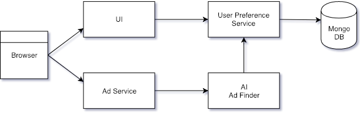

Distributed Tracing Comparison
=====

The repository has 3 branches off of the master branch. One for each of 3 distributed tracing implementations, 
namely, [New Relic](https://newrelic.com/), [OpenTracing](https://opentracing.io/), and [OpenCensus](https://opencensus.io/).
The master branch contains 4 distinct [Spring Boot](https://spring.io/projects/spring-boot) services that all work together as a single distributed application. 
This application is a simple (unintelligent) ad targeting system for an imaginary travel agency. The system architecture looks 
like the following.



All individual services can be run together using [docker compose](https://docs.docker.com/compose/overview/). You must [install
docker](https://docs.docker.com/install/) as a prerequisite.

```bash
docker-compose up --build
```
The command above will build each of the spring boot services, start mongodb and then start each of the services. Each distributed tracing
implementation may have slight differences, but the same command will start everything need to run the complete application.

One of the main reasons to use distributed tracing is to be able to track down failures within a distributed system. 
Therefore, throughout the code there are artificially created exceptions and thread sleeps that occur at random intervals.
Hopefully all of the artificial problems can be found using only the tracing results. 

New Relic
-----
[New Relic](https://newrelic.com/) is a commercial SaaS based application monitoring system. To evaluate new relic yourself you will need a valid license key.
To implement New Relic monitoring you do not have to change any code, though adding additional application specific monitoring
in your code base creates added insight. To get the application running with New Relic you will need to export your license key
as an environment variable before bringing up the compose environment.

```bash
NEW_RELIC_LICENSE_KEY=<Your License Key Here> docker-compose up --build
```

To see the New Relic implementation view the [diff between the master and newrelic](https://github.com/shagreel/tracing/compare/master...newrelic) branches.

OpenTracing
-----
[OpenTracing](https://opentracing.io/) is an API [specification](https://opentracing.io/specification/) implemented by several frameworks, including 
Spring Boot, to enable distributed tracing. OpenTracing supports numerous trace storage and reporting backends. For the OpenTracing
implementation we will be using [Jaeger](https://www.jaegertracing.io/) as the distributed tracing system. This means that the 
docker compose environment will also enable a stand alone Jaeger service.

To see the OpenTracing implementation view the [diff between the master and opentracing](https://github.com/shagreel/tracing/compare/master...opentracing) branches.

OpenCensus
-----
[OpenCensus](https://opencensus.io/) is a specific set of libraries developed by Google that allows the collection of metrics 
and distributed traces in your service. Similar to OpenTracing, the traces and metrics can be sent to various backend services. The
OpenCensus implementation will also be using [Jaeger](https://www.jaegertracing.io/) as the distributed tracing backend. This means that the 
docker compose environment will also enable a stand alone Jaeger service.

To see the OpenCensus implementation view the [diff between the master and opencensus](https://github.com/shagreel/tracing/compare/master...opencensus) branches.
